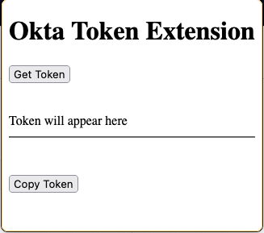
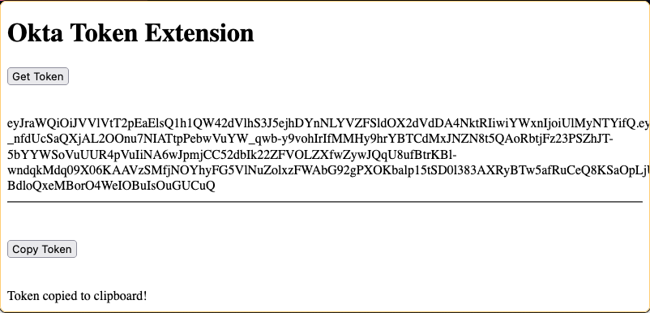

# Okta Token Access Extension

## Description

The Okta Token Access Extension is a simple Firefox extension designed to retrieve an access token stored in the browser's `localStorage` under the key `okta-token-storage`. This extension is particularly useful for developers and users who frequently interact with applications using Okta for authentication and need to quickly access their tokens.

## Features

- Retrieve an access token from `localStorage`.
- Display the token in a popup window.
- Copy the token to the clipboard with a single click.

## Installation

To install this extension:

1. Clone or download the repository to your local machine.
2. Open Firefox and navigate to `about:debugging`.
3. Click "This Firefox" and then "Load Temporary Add-on".
4. Browse to the location of the cloned repository and select the `manifest.json` file to load the extension.

**Note:** This extension is intended for local or temporary use and hasn't been published on the Firefox Add-ons store.

## Usage

To use the extension:

1. Navigate to a webpage that uses Okta for authentication and stores the token in `localStorage`.
2. Click on the extension icon in the Firefox toolbar.
3. In the popup that appears, click the "Get Token" button. The token should be displayed in the popup window.
4. Click the "Copy Token" button to copy the token to your clipboard.

## Contributing

Contributions to enhance the functionality of this extension are welcome. Please feel free to fork the repository, make changes, and open a pull request with your improvements.

## License

MIT License

## Disclaimer

This extension is provided for educational and testing purposes only. Be cautious with handling and displaying sensitive information such as access tokens.

